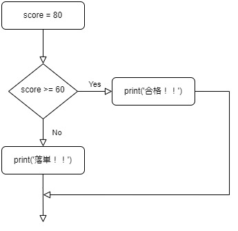
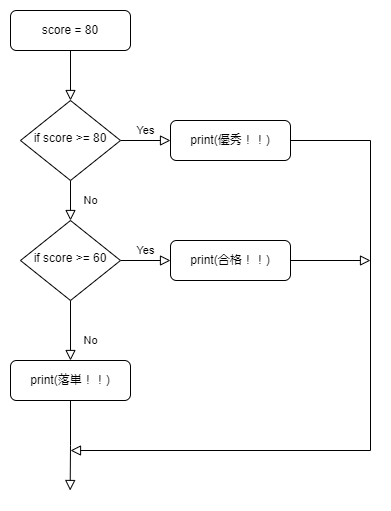

# 第4回 制御構文

## 1. はじめに

今回は，制御構文を見ていきます．
制御構文を使うことで，条件によって処理を分岐させたり，繰り返し処理を行ったりすることができるようになります．
これのおかげで，より複雑な処理を行うことができるようになります．

今回見ていく制御構文は，

- if文
    - 条件分岐
- while文
  - ある条件が成り立つ間，繰り返す
- for文
  - コレクター（リストなど）の各要素に対して同じ処理を繰り返す

です．
順番に見ていきましょう．


## 2. if 文 - 条件分岐

if文は，条件によって処理を分岐させるための制御構文です．
if文の基本的な構文は以下の通りです．

```python
if <条件式>:
    <条件式がTrueのときの処理>
else:
    <条件式がFalseのときの処理>
```

例えば，このように使います．

```python
# credit.py

score = 80

if score >= 60:
    print("合格！！")
else:
    print("落単！！")

```
実行結果
```
$ python3 credit.py
単位取得
```

`score` を変えて，実行結果が変わることを確認してみましょう．

このコードでは，点数`score`が60点以上かどうかを判定しています．
60点以上の場合は，`print("合格！！")`が実行され，60点未満の場合は，`print("落単！！")`が実行されます．

フローチャートで表すとこうなります．



このコードを少し詳しく見てみましょう．
まず，条件部分はこのようになっています．

```python
if score >= 60:
```

`if` キーワードで始まり，条件式が続き，行の最後にコロン`:`がついています．
`score >= 60` が条件式です．この式は，`score`が60以上のときに`True`，60未満のときに`False`を返します．
`>=` などは比較演算子と呼ばれ，まとめると以下のようになります．

比較演算子（復習）
| 演算子 | 意味 |
|:---:|:---:|
| == | 等しい |
| != | 等しくない |
| < | より小さい |
| <= | 以下 |
| > | より大きい |
| >= | 以上 |


条件式が`True`のときに実行したい（1行以上の）処理を，`if`の次の行からインデントして書きます．
インデントとは字下げとも呼ばれ，Tabキーを押すことでインデントを入れることができます．
（細かい話をするとタブ文字だったりスペースだったりしますが，今はあまり気にしなくて大丈夫です．）　
今回の場合は，`print("合格！！")`が実行されます．

条件式が`False`のときに実行したい（1行以上の）処理を，`else`の次の行からインデントして書きます．

このように，条件によって処理を分岐させることができます．


次に，3つ以上に分岐する場合を見てみましょう．
この場合，
- もし条件1が`True`なら処理1を実行
- 条件1が`False`の場合，
  - 条件2が`True`なら処理2を実行
  - 条件2が`False`なら処理3を実行

のように分かれます．

このような場合は，`elif`を使います．
例えば，このように書くことができます．

```python
# credit2.py

score = 80

if score >= 80:
    print("優秀！！")
elif score >= 60:
    print("合格！！")
else:
    print("落単！！")
```

実行結果
```
$ python3 credit2.py
優秀！！
```

`elif`は，`else`と`if`をつなげたものです．他のプログラミング言語では`else if`と書くことが多いので注意してください．
初めの`if`の条件式が`False`の場合に，次の`elif`の条件式を判定します．
もし初めの`if`の条件式が`True`の場合は，`elif`の条件式は判定されません．

フローチャートに書くと，以下のようになります．




`elif`は複数書くことができるので，4つ以上に分岐させることもできます．


### 練習問題
解答例はGitHubの [section4/sample/ex/ex2.py](./sample/ex/ex2.py) にあります．

変数`number`を定義し，その値が偶数か奇数かを判定して出力するプログラムを書いてください．

```python
number = 57

# ここにコードを書く

```
----

## 3. while 文 - 繰り返し

while文はある条件が成り立つ間，処理を繰り返すための制御構文です．
while文の基本的な構文は以下の通りです．

```python
while <条件式>:
    <条件式がTrueの間繰り返す処理>
```

例えば，このように使います．

```python
# while_test.py
i = 0

while (i < 10):
    print(i)
    i += 1

print('繰り返しが終わりました')

```


出力は以下のようになります．
```
0
1
2
3
4
5
6
7
8
9
繰り返しが終わりました
```

このコードは、変数 `i` を使用して、0から9までの数字を表示するループ処理を行います。

1. 最初の行では、変数 `i` に0を代入しています。

2. `while` ループが始まります。ループの条件式は `(i < 10)` です。変数 `i` が10未満の場合、ループ内のコードが実行されます。条件式が `True` である限り、ループは継続します。

   1. ループ内のコードブロックでは、`print(i)` というコードが実行されます。これにより、変数 `i` の現在の値が表示されます。

   2. 次に、`i = i + 1` というコードが実行されます。これにより、変数 `i` の値が1増えます。

   3. ループの先頭に戻り、再び条件式 `(i < 10)` が評価されます。もし変数 `i` が10未満であれば、ループ内のコードが再度実行されます。これにより、0から9までの数字が順番に表示されます。

   4. 変数 `i` の値が10以上になった場合、条件式 `(i < 10)` は `False` となり、ループから抜け出します。

3. ループの後にある `print('繰り返しが終わりました')` は、ループが終了した後に実行されます。この行により、"繰り返しが終わりました" というメッセージが表示されます。

while 文は，何かが起きるまでループさせたいが，それがいつ起きるか分からない時などに便利です．
例えば，ユーザーが何か入力するまで待つようなプログラムを書くことができます．

```python
# echo.py
while True:
    input_data = input('何か入力してください．:qを入力すると終了します．> ')
    if input_data == ':q':
        break
    print(input_data * 2)

```

新しいものがいくつか出てきたので紹介します．

- `break` は，ループを抜け出すためのキーワードです．この部分が実行されると，今いるループを終了させます．

- `input()` は，ユーザーからの入力を受け取るためのものです．`input()`の中に文字列を入れると，その文字列を表示してから入力を受け取ります．
以下のようにして使うことが多いです．このとき，変数 `input_data` に入力された文字列が代入されます．
```python
input_data = input('入力してください．')
```

- 文字列型に演算子`*`を使うと，演算子の後ろの数字の回数分文字列を繰り返すことができます．
`"a" * 5` は `"aaaaa"` と同じになります．

では，`echo.py`について，見てみましょう．

このコードは、ユーザーからの入力を受け付けるループ処理を行います。入力された文字列を2回繰り返してして表示し、`:q` が入力されるとループを終了します。

1. `while True:` の行で無限ループが始まります。条件部分は常に `True` なので、このループは無限に繰り返されます。

2. ループ内のコードブロックでは、`print('何か入力してください．:qを入力すると終了します．')` というメッセージが表示されます。ユーザーに入力を促すメッセージです。

3. `input('$ ')` はユーザーからの入力を受け取ります。`$` というプロンプトが表示され、ユーザーが入力した文字列が変数 `input_data` に代入されます。

4. `if input_data == ':q':` の行では、変数 `input_data` の値が `:q` と一致するかどうかをチェックしています。もし一致した場合、`break` 文が実行されてループが終了します。

5. もし変数 `input_data` の値が `:q` と一致しない場合、`print(input_data * 2)` が実行されます。入力された文字列が2倍された結果が表示されます。

6. ループの先頭に戻り、再びユーザーからの入力を受け付ける処理が繰り返されます。

`break` の他に，`continue` というものもループの中で使えます．
ループの中で `continue` が実行されると，そのループの先頭に戻ります．
例えば以下のようにして使うことができます．

```python
# continue.py

i = 0
while i < 10:
    i += 1
    if i % 3 == 0:
        continue
    print(i)
```

実行結果
```
1
2
4
5
7
8
10
```

`i`が3の倍数の時は `continue`が実行され，ループの先頭に戻るので `print(i)` は実行されません．

それでは，練習問題を解いてみましょう．

### 練習問題
解答例はGitHubの [section4/sample/ex/ex3.py](./sample/ex/ex3.py) にあります．


10から順番にカウントダウンし，0になったら "あけおめ！" と出力するコードを書いて下さい．

出力例：
```
10
9
8
7
6
5
4
3
2
1
0
あけおめ！
```

----


## 4. for 文 - 繰り返し

for文は，タプルやリストなど（の，イテラブルなオブジェクト）から一つずつ要素を取り出して処理をする場合に使われます．
Javaのような他の言語のfor文とは少し様子が違うので注意してください．

for文の基本的な構文は以下の通りです．

```python
for <変数> in <リストなど> :
    <処理>
```

例えば，このように使います．

```python
# for_test.py
members = ['crashrt', 'cicada', 'segre']

for member in members:
    print(member + 'さん，こんにちはこんにちは')
```

出力結果
```
crashrtさん，こんにちはこんにちは
cicadaさん，こんにちはこんにちは
segreさん，こんにちはこんにちは
```

このコードは，リスト `members` の要素を一つずつ取り出して `member` に代入し，
`print(member + 'さん，こんにちはこんにちは')` を実行しています．

このように，forループでは，ループが回るたびにリストなどから要素が取り出され，変数に代入されます．
このループはリストから全ての要素が取り出されるまで続きます．

他の例を見てみましょう．

```python
# for_range.py

for i in range(10):
    print(i)

print('繰り返しが終わりました')
```
実行結果
```
0
1
2
3
4
5
6
7
8
9
繰り返しが終わりました
```

while 文の時に書いたコードをfor文で書き直すとこのようになります．
ここで，`range()` という関数を紹介します．

組み込み関数である `range()` は，整数を順番に生成してforループに渡してくれます．
括弧の中をどう書くかによって，どのように生成するかが変わります．

- `range(n)` のように書くと，0 から n-1 までの整数を順番に生成します．
- `range(start, end)` のように書くと，start から end-1 までの整数を順番に生成します．
- `range(start, end, step)` のように書くと，start から end-1 までの整数を step ずつ増やしながら生成します．

ここで `n`，`start`，`end`，`step` は全て整数です．

for文の中で，順番に整数を使いたい場合などに `range()` は便利です．

第1回のときに実行した FizzBuzz はfor文とif文を組み合わせたもので，`range()`も使っています．

```python
for i in range(100):
    if i % 3 == 0 and i % 5 == 0:
        print("FizzBuzz")
    elif i % 3 == 0:
        print("Fizz")
    elif i % 5 == 0:
        print("Buzz")
    else:
        print(i)
```

`for i in range(100) :` で0から99までの整数を順番に生成し，`i` に代入しています．
そして，各`i`に対して，if文で処理が分岐しているのが分かると思います．

`if i % 3 == 0 and i % 5 == 0:` のように，if文やwhile文の条件部分では `and` や `or` を使って
複数の条件を組み合わせることもできます．
`and` や `or`，`not`に関しては，第2回を参照してください．

### 練習問題
解答例はGitHubの [section4/sample/ex/ex4.py](./sample/ex/ex4.py) にあります．

0から40の値を順番に表示するプログラミングを書いてください．
ただし，3の倍数，または3のつく数字のときは "hoge" と表示するようにしてください．

ヒント：
変数`n`が3がつく数字かどうかは `'3' in str(n)` で判定できます．

```python
n, m = 123, 111
print('3' in str(n)) # True
print('3' in str(m)) # False
```

<details>
<summary>出力例</summary>

```
1
2
hoge
4
5
hoge
7
8
hoge
10
11
hoge
hoge
14
hoge
16
17
hoge
19
20
hoge
22
hoge
hoge
25
26
hoge
28
29
hoge
hoge
hoge
hoge
hoge
hoge
hoge
hoge
hoge
hoge
40
```
</details>

-----


## 5. 入れ子・ネストについて

if文やwhile文・for文の中にさらにif文やwhile文・for文を入れることができます．
これをネスト（入れ子）と呼び，if文だと例えばこのようになります．

```python
# biggest.py

a = 3
b = 5
c = 7

if a > b:
    if a > c:
        print("a is the biggest")
    else:
        print("c is the biggest")
else:
    if b > c:
        print("b is the biggest")
    else:
        print("c is the biggest")

```

実行結果
```
c is the biggest
```

このコードは，3つの変数 `a`，`b`，`c` の値を比較し，最大の値を表示するためのものです．

1. まず，条件式 `a > b` が評価されます．

2. もし最初の条件式 `a > b` が `True` だった場合
   1. すぐ次のインデントされたブロックの中のコードが実行されます．
   2. このブロック内の条件式 `a > c` が評価されます．

   3. もし最初の条件式が `True` かつ2番目の条件式 `a > c` が `True` だった場合，"a is the biggest" というテキストが表示されます．これは，変数 `a` が最大である場合に実行されます．

   4. もし最初の条件式が `True` だったが，2番目の条件式が `False` だった場合，"c is the biggest" というテキストが表示されます．これは，変数 `a` が最大である場合に実行されます．

3. もし最初の条件式が `False` だった場合，
   1. `else:`以降のブロックの中のコードが実行されます．
   2. このブロック内の条件式 `b > c` が評価されます．

   3. もし最初の条件式が `False` かつ3番目の条件式 `b > c` が `True` だった場合，"b is the biggest" というテキストが表示されます．これは，変数 `b` が最大である場合に実行されます．

   4. もし最初の条件式が `False` かつ3番目の条件式が `False` だった場合，"c is the biggest" というテキストが表示されます．これは，変数 `c` が最大である場合に実行されます．


for文の例も見てみましょう．

```python
# nested_for.py
for i in range(7, 10):
    print(i, 'の段')
    for j in range(1, 10):
        print(i, '*', j, '=', i * j)
```
<details>
<summary>実行結果</summary>

```
7 の段
7 * 1 = 7
7 * 2 = 14
7 * 3 = 21
7 * 4 = 28
7 * 5 = 35
7 * 6 = 42
7 * 7 = 49
7 * 8 = 56
7 * 9 = 63
8 の段
8 * 1 = 8
8 * 2 = 16
8 * 3 = 24
8 * 4 = 32
8 * 5 = 40
8 * 6 = 48
8 * 7 = 56
8 * 8 = 64
8 * 9 = 72
9 の段
9 * 1 = 9
9 * 2 = 18
9 * 3 = 27
9 * 4 = 36
9 * 5 = 45
9 * 6 = 54
9 * 7 = 63
9 * 8 = 72
9 * 9 = 81
```
</details>


`i`の値が7, 8, 9と変わりながら，各値に対して`j`が1から9の値を取って九九を表示します．

このように入れ子にすることで，より複雑な処理を行うことができます．

## 6. まとめ

今回は，制御構文について見てきました．

- if文
  - 条件分岐で使う
- while文
  - 条件が成り立つ間，繰り返す
- for文
  - コレクター（リストなど）の各要素に対して同じ処理を繰り返す

制御構文を使うことで，より複雑な処理を行うことができるようになります．
制御構文は，プログラミングをする上で欠かせないものです．
ぜひ，自分でいろいろなプログラムを書いてみてください．

次回予告：第5回では，関数について見ていきます．
今まで `print()` や `range()` などの関数が出てきましたが，
これらが何者であるか，そして自分で新しく関数を作る方法について見ていきます．
